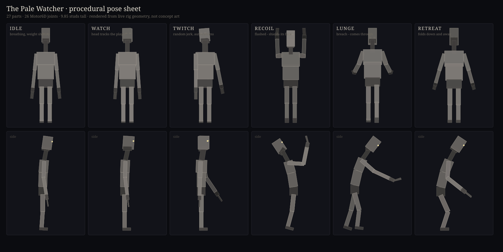

# NightLoop

A modular night-loop horror package for Roblox, plus the Studio bridge that
built it.

A 15-minute night in five escalating phases. Entities hunt you; a flashlight
with charges is your only defence; three strikes and the house takes you.
Survive to 06:00 and the lights come up.

Everything is generated in code. There are **no uploaded assets and no asset
IDs anywhere in this repo** — the monsters are built from primitives at
runtime and animated procedurally, so the whole thing ships as source and
drops into any place.



---

## Layout

```
src/            the package      -> ServerScriptService.NightLoop
  Bootstrap.server.lua           the only Script; everything else is a module
  Config.lua                     ALL tuning and place-specific names
  Director.lua                   phases, strikes, night start/end
  Registry.lua                   discovers and validates entities
  EntityBase.lua  Signal.lua  Net.lua
  Beam.lua  Flash.lua            flashlight charges, cones, see-through casts
  Atmosphere.lua                 night preset, fog creep, dawn
  MonsterRig.lua  MonsterAnimator.lua    the Pale Watcher + procedural poses
  CrawlerRig.lua                 the Crawl + procedural gait
  Entities/                      one module per entity, hot-droppable

client/         -> StarterPlayer.StarterPlayerScripts
  NightLoopClient.client.lua           HUD, strike pips, cues, end cards
  NightLoopFirstPerson.client.lua      forced first person, own body visible

tool/
  FlashInput.client.lua          goes INSIDE the Flashlight Tool (not auto-synced)

bridge/         the Arena -> Roblox Studio connector
docs/           full package documentation + the pose sheet
tools/          pre-push checks and the pose-sheet renderer
```

## Install

### With Rojo

```bash
rojo serve          # default.project.json maps src/ and client/ for you
```

Then drag `tool/FlashInput.client.lua` into your Flashlight `Tool` manually —
it lives inside the tool, so it is deliberately outside the synced tree.

### By hand

1. Create a `Folder` named `NightLoop` in `ServerScriptService`.
2. Put `Bootstrap.server.lua` in as a `Script` named `Bootstrap`; every other
   `src/*.lua` as a `ModuleScript` of the same name.
3. `src/Entities/*.lua` as `ModuleScript`s inside a `Folder` named `Entities`.
4. `client/*.client.lua` as `LocalScript`s in `StarterPlayerScripts`.
5. `tool/FlashInput.client.lua` as a `LocalScript` inside your Flashlight Tool.

## Point it at your place

Everything place-specific is in `Config.World`:

```lua
World = {
    SpotsFolder          = "Spots",       -- Workspace folder of monster positions
    FlashlightToolName   = "Flashlight",
    FlashlightLightPart  = "Light",
    FlashlightAttachment = "LightOrigin",
    FlashlightBeamName   = "Light",
    DoorName             = "Door",
}
```

Entities that cannot find what they need **disable themselves with a warning**
instead of erroring the night, so a partial setup still runs.

```lua
Config.Mode      = "OneNight"   -- or "Endless"
Config.AutoStart = true         -- false to drive Director:StartNight() yourself
```

## Status

| Entity | Phase | State |
|---|---|---|
| Window Monster | 1+ | live — flash-repel, breach siege, procedural rig |
| Knocker | 2+ | live — door rattles, escalates to slams |
| Crawl | 3+ | live — ceiling/wall skitter, drops and strikes |
| Whisperer | — | coded, **needs audio asset IDs** |
| Breathless | 4 | stub — needs room volumes |
| Ticking Man | 5 | stub — needs room volumes and clocks |

Full documentation, including the axis conventions that will bite you if you
edit the rigs: **[docs/NIGHTLOOP.md](docs/NIGHTLOOP.md)**.

## The bridge

`bridge/` contains the Arena → Roblox Studio connector used to build this: a
dependency-free job-queue server plus a local Studio plugin, letting an agent
run Luau, push script trees, and inspect the data model in a live session.
Every mutating job is a single undo step.

```bash
cd bridge
python setup.py --tunnel
```

See **[bridge/WINDOWS-START-HERE.md](bridge/WINDOWS-START-HERE.md)** to set it
up, and **[AGENTS.md](AGENTS.md)** if you are an AI agent picking this up —
it documents the job contracts, the verified workflow, and the traps.

> The bridge token is a bearer credential. `bridge.token` is gitignored;
> rotate with `python setup.py --rotate`, and kill the tunnel when idle.

## Before you push changes

```bash
tools/check_globals.sh      # undefined globals compile clean in Luau and
                            # explode at runtime - this catches them
tools/check_secrets.sh      # setup.py bakes the live token into
                            # bridge/ArenaBridge.lua; this stops it reaching a commit
```

## Licence

MIT — see [LICENSE](LICENSE).
